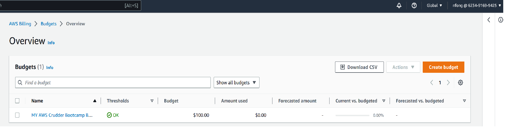
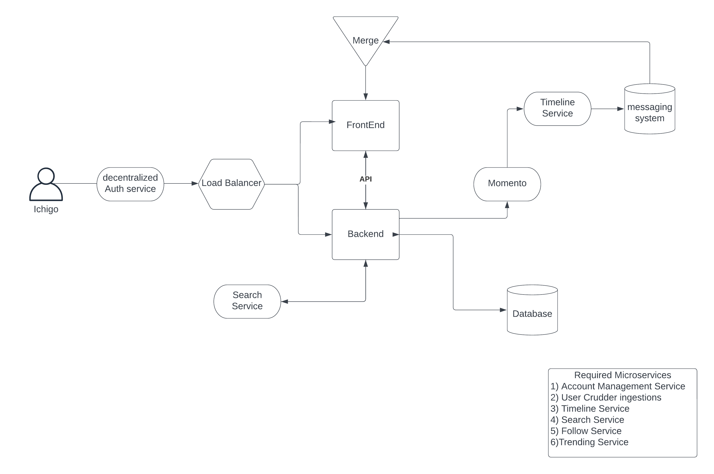

# Week 0 — Billing and Architecture

## Required Homework 

### Getting The AWS CLI Working
• Install the AWS CLI into Gitpod environment from (https://docs.aws.amazon.com/cli/latest/userguide/getting-started-install.html)
```
curl "https://awscli.amazonaws.com/awscli-exe-linux-x86_64.zip" -o "awscliv2.zip"
unzip awscliv2.zip
sudo ./aws/install
```

• Update .gitpod.yml so the AWS CLI will always be installed since the Gitpod environment gets destroyed after loggin out:
```
tasks:
  - name: aws-cli
    env:
      AWS_CLI_AUTO_PROMPT: on-partial
    init: |
      cd /workspace
      curl "https://awscli.amazonaws.com/awscli-exe-linux-x86_64.zip" -o "awscliv2.zip"
      unzip awscliv2.zip
      sudo ./aws/install
      cd $THEIA_WORKSPACE_ROOT
```

### Create an Admin account and Generate AWS Credentials

• Went to the IAM Users Console and created an administrator  account
• Gave administrator account console access 
• Added administrator account into the AdministratorAccess Group
• Setup MFA for the for the administrator account
• Create Secret and Access Keys for admin account
• Backed up keys to a CSV to a google drive account
• Granted administrator access to the Billing portal

Add AWS Credentials to Gitpod Environment
• Added three environment variables AWS Secret and Access Keys to the Gitpod Environment:
```
gp env AWS_ACCESS_KEY_ID=""
gp env AWS_SECRET_ACCESS_KEY=""
gp env AWS_DEFAULT_REGION=""
```
• Set Default region to us-west-1

Setup Billing 
•	Setup billing preferences to Receive Billing Alerts as well as Receive Free Tier Usage Alerts


### Create a Billing Alarm
• Created an sns topic via the CLI
```
aws sns create-topic --name billing-alarm
```

• Created a subscription to administrator email account via the CLI
```
aws sns subscribe \
   --topic-arn TopicARN \
   --protocol email \
   --notification-endpoint your@email.com
```
• Created a json file to configure billing alarm


### Create an AWS Budget

• Create a json file to configure AWS budget

• Set the budget to alert at $100



### Conceptual Diagram




[Lucid Charts for Conceptual Diagram Link](https://lucid.app/lucidchart/8c62361f-8ccc-4278-9f3f-c05559f4ef02/edit?view_items=f3iwx9ATfltJ&invitationId=inv_d8b9bc7b-6e11-4e8a-976b-186cc09daa36)


### Architecture Diagram of Crudder


[Lucid Charts Share Link](https://lucid.app/lucidchart/78d37a86-725e-400b-b3a4-0c1ced0d1c18/edit?viewport_loc=188%2C159%2C2219%2C1055%2C0_0&invitationId=inv_2ef500dd-40cc-4564-997e-dc8faac4a6ae)


