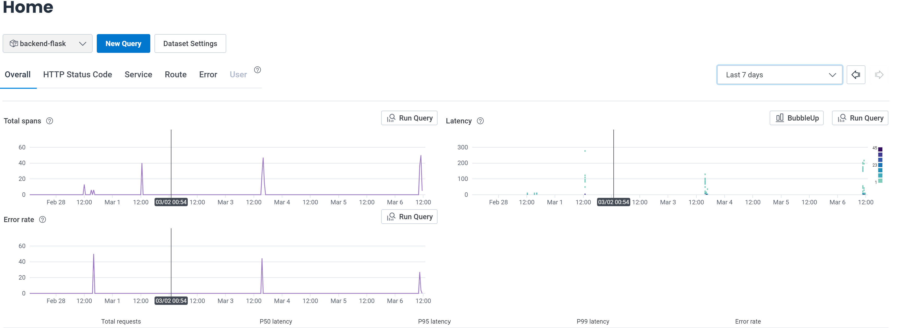
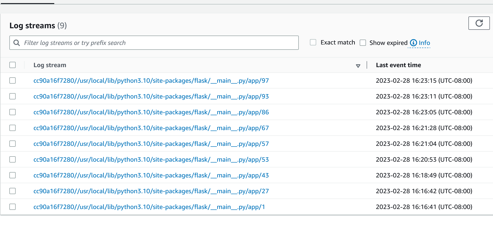
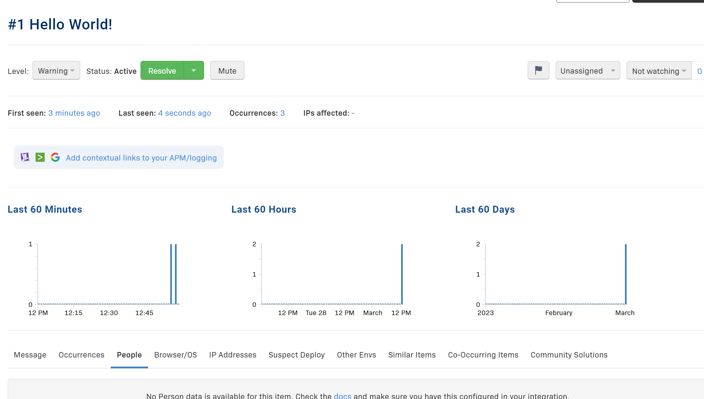
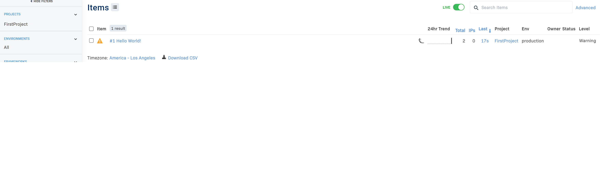
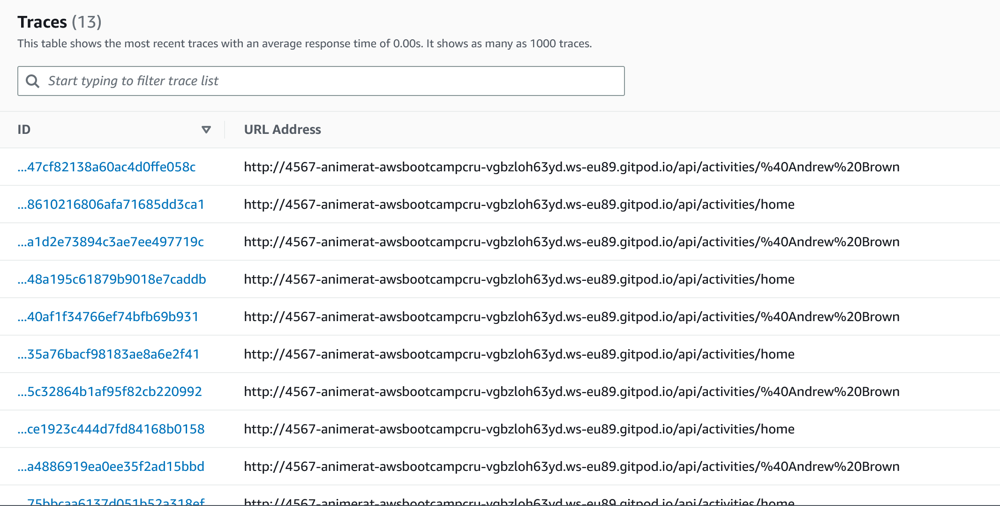
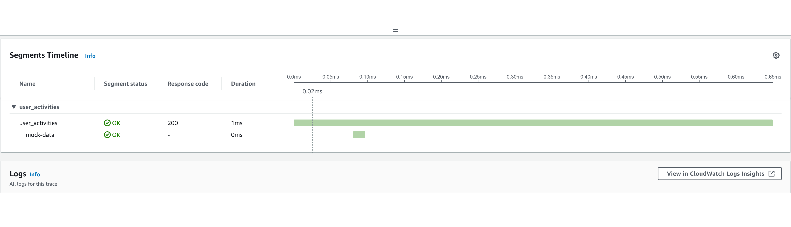

# Week 2 — Distributed Tracing

## Required Homework

### Getting HoneyComb Configured

Add the opentelemetry libraries to our python environment

```
opentelemetry-api 
opentelemetry-sdk 
opentelemetry-exporter-otlp-proto-http 
opentelemetry-instrumentation-flask 
opentelemetry-instrumentation-requests
```

From a python terminal install the new opentelemetry libraries
```
pip install -r requirements.txt
```

Within the `app.py` script, import Opentelemtry functions:

```python
from opentelemetry import trace
from opentelemetry.instrumentation.flask import FlaskInstrumentor
from opentelemetry.instrumentation.requests import RequestsInstrumentor
from opentelemetry.exporter.otlp.proto.http.trace_exporter import OTLPSpanExporter
from opentelemetry.sdk.trace import TracerProvider
from opentelemetry.sdk.trace.export import BatchSpanProcessor
```

Within the `app.py` script, initialize tracing and exporter to send data to Honeycomb:
```python
provider = TracerProvider()
processor = BatchSpanProcessor(OTLPSpanExporter())
provider.add_span_processor(processor)
trace.set_tracer_provider(provider)
tracer = trace.get_tracer(__name__)
```

Within the `app.py` script, initialize instrumentation with Flask:
```python
app = Flask(__name__)
FlaskInstrumentor().instrument_app(app)
RequestsInstrumentor().instrument()
```

Add environment variables to the backend-flask container in docker compose:
```Dockerfile
OTEL_EXPORTER_OTLP_ENDPOINT: "https://api.honeycomb.io"
OTEL_EXPORTER_OTLP_HEADERS: "x-honeycomb-team=${HONEYCOMB_API_KEY}"
OTEL_SERVICE_NAME: "${HONEYCOMB_SERVICE_NAME}"
```

Configure personal account API keys into gitpod environment:
```
export HONEYCOMB_API_KEY=""
export HONEYCOMB_SERVICE_NAME="Cruddur"
gp env HONEYCOMB_API_KEY=""
gp env HONEYCOMB_SERVICE_NAME="Cruddur"
```

#### Results from HoneyComb Dashboard


#### Results from HoneyComb Traces


### Getting CloudWatch logs configured

Add CloudWatch libraries to our python environment

```
watchtower
```

From a python terminal install the new CloudWatch libraries
```
pip install -r requirements.txt
```

Within the `app.py` script, import Cloudwatch functions:

```python
import watchtower
import logging
from time import strftime
```

Within the `app.py` script, configure Logger to user Cloudwatch:
```python
LOGGER = logging.getLogger(__name__)
LOGGER.setLevel(logging.DEBUG)
console_handler = logging.StreamHandler()
cw_handler = watchtower.CloudWatchLogHandler(log_group='cruddur')
LOGGER.addHandler(console_handler)
LOGGER.addHandler(cw_handler)
LOGGER.info("some message")
```

Within the `app.py` script, configure an after request to have Logger send data to Cloudwatch:
```python
@app.after_request
def after_request(response):
    timestamp = strftime('[%Y-%b-%d %H:%M]')
    LOGGER.error('%s %s %s %s %s %s', timestamp, request.remote_addr, request.method, request.scheme, request.full_path, response.status)
    return response
```

Add environment variables to the backend-flask container in docker compose:
```Dockerfile
AWS_DEFAULT_REGION: "${AWS_DEFAULT_REGION}"
AWS_ACCESS_KEY_ID: "${AWS_ACCESS_KEY_ID}"
AWS_SECRET_ACCESS_KEY: "${AWS_SECRET_ACCESS_KEY}"
```

#### CloudWatch Logs for Crudder


### Rollbar 

Create a new project in [Rollbar](https://www.rollbar.com) called Crudder

Add Rollbar libraries to our python environment

```
blinker
rollbar
```

From a python terminal install the new Rollbar libraries
```
pip install -r requirements.txt
```

Add the Rollbar access token to our environment:
```
export ROLLBAR_ACCESS_TOKEN=""
gp env ROLLBAR_ACCESS_TOKEN=""
```

Within the `app.py` script, import Rollbar functions:

```python
import rollbar
import rollbar.contrib.flask
from flask import got_request_exception
```

Within the `app.py` script, configure logging into Rollbar:
```python
rollbar_access_token = os.getenv('ROLLBAR_ACCESS_TOKEN')
@app.before_first_request
def init_rollbar():
    """init rollbar module"""
    rollbar.init(
        # access token
        rollbar_access_token,
        # environment name
        'production',
        # server root directory, makes tracebacks prettier
        root=os.path.dirname(os.path.realpath(__file__)),
        # flask already sets up logging
        allow_logging_basic_config=False)

    # send exceptions from `app` to rollbar, using flask's signal system.
    got_request_exception.connect(rollbar.contrib.flask.report_exception, app)
```

Within the `app.py` script, add an endpoint to test rollbar:
```python
@app.route('/rollbar/test')
def rollbar_test():
    rollbar.report_message('Hello World!', 'warning')
    return "Hello World!"
```

Add Rollbar access token to docker compose:
```Dockerfile
ROLLBAR_ACCESS_TOKEN: "${ROLLBAR_ACCESS_TOKEN}"
```

#### Rollbar Dashboard


#### Rollbar Items


### Getting X-Ray Configured

Add the X-Raylibraries to our python environment

```
aws-xray-sdk
```

From a python terminal install the new X-Ray libraries
```
pip install -r requirements.txt
```

Within the `app.py` script, import X-Ray functions:

```python
from aws_xray_sdk.core import xray_recorder
from aws_xray_sdk.ext.flask.middleware import XRayMiddleware
```

Within the `app.py` script, Configure X-Ray recorder and middleware:
```python
xray_url = os.getenv("AWS_XRAY_URL")
xray_recorder.configure(service='backend-flask', dynamic_naming=xray_url)
XRayMiddleware(app, xray_recorder)
```


Configure AWS-Region to send X-Ray logs to:
```
export AWS_REGION="us-west-2"
gp env AWS_REGION="us-west-2"
```

### Setting AWS X-Ray Resources

Add to `aws/json/xray.json`

```json
{
  "SamplingRule": {
      "RuleName": "Cruddur",
      "ResourceARN": "*",
      "Priority": 9000,
      "FixedRate": 0.1,
      "ReservoirSize": 5,
      "ServiceName": "backend-flask",
      "ServiceType": "*",
      "Host": "*",
      "HTTPMethod": "*",
      "URLPath": "*",
      "Version": 1
  }
}

```

From the, CLI create a X-Ray group call Crudder
```
FLASK_ADDRESS="https://4567-${GITPOD_WORKSPACE_ID}.${GITPOD_WORKSPACE_CLUSTER_HOST}"
aws xray create-group \
   --group-name "Cruddur" \
   --filter-expression "service(\"backend-flask\")"
```

From the CLI, create a sampling rule using the xray.json
```
aws xray create-sampling-rule --cli-input-json file://aws/json/xray.json
```

### Add Daemon Service to Docker Compose

```Dockerfile
  xray-daemon:
    image: "amazon/aws-xray-daemon"
    environment:
      AWS_ACCESS_KEY_ID: "${AWS_ACCESS_KEY_ID}"
      AWS_SECRET_ACCESS_KEY: "${AWS_SECRET_ACCESS_KEY}"
      AWS_REGION: "us-west-2"
    command:
      - "xray -o -b xray-daemon:2000"
    ports:
      - 2000:2000/udp
```

Add environment variables to the backend-flask container in docker compose:
```Dockerfile
AWS_XRAY_URL: "*4567-${GITPOD_WORKSPACE_ID}.${GITPOD_WORKSPACE_CLUSTER_HOST}*"
AWS_XRAY_DAEMON_ADDRESS: "xray-daemon:2000"
```

### Configuring X-Ray Segmentation

Within the `app.py` script replace the /api/activities/home with the following:


```python
@app.route("/api/activities/home", methods=['GET'])
@xray_recorder.capture('activities_home')
def data_home():
  data = HomeActivities.run()
  return data, 200
```
Within the `app.py` script replace the /api/activities/@<string:handle> with the following:
```python
@app.route("/api/activities/@<string:handle>", methods=['GET'])
@xray_recorder.capture('activities_users')
def data_handle(handle):
  model = UserActivities.run(handle)
  if model['errors'] is not None:
    return model['errors'], 422
  else:
    return model['data'], 200
```
Within the `app.py` script replace the /api/activities/@<string:handle> with the following:

```python
@app.route("/api/activities/<string:activity_uuid>", methods=['GET'])
@xray_recorder.capture('activities_show')
def data_show_activity(activity_uuid):
  data = ShowActivity.run(activity_uuid=activity_uuid)
  return data, 200
```

Within the `user_activities.py` script, import xray_recorder, create a segment called user_activities, create a subsegment called mock-data:

```python

from datetime import datetime, timedelta, timezone
from aws_xray_sdk.core import xray_recorder
class UserActivities:
  def run(user_handle):
    try:
    # xray ---
      segment = xray_recorder.begin_segment('user_activities')

      model = {
        'errors': None,
        'data': None
      }
    

      now = datetime.now(timezone.utc).astimezone()

      if user_handle == None or len(user_handle) < 1:
        model['errors'] = ['blank_user_handle']
      else:
        now = datetime.now()
        results = [{
          'uuid': '248959df-3079-4947-b847-9e0892d1bab4',
          'handle':  'Andrew Brown',
          'message': 'Cloud is fun!',
          'created_at': (now - timedelta(days=1)).isoformat(),
          'expires_at': (now + timedelta(days=31)).isoformat()
        }]
        model['data'] = results

      subsegment = xray_recorder.begin_subsegment('mock-data')
      # xray ---
      dict = {
        "now": now.isoformat(),
        "results-size": len(model['data'])
      }
      subsegment.put_metadata('key', dict, 'namespace')
      xray_recorder.end_subsegment()
    finally:
      xray_recorder.end_subsegment()
    return model
```

#### X-Ray Traces


#### X-Ray Traces with SubSegments

