# Week 8 — Serverless Image Processing

## Setting up CDK to Create a Thumbing Serverless Stack

### Create a new directory for serverless cdk

Create a new directory called thumbing-serverless-cdk under `/workspace/aws-bootcamp-cruddur-2023`

### Installing CDK

Run the following command to install AWS CDK

```
npm install aws-cdk -g
```

To pre-install AWS CDK in  your gitpod enviroment.  You will need to add the following to yout .gitpod.yaml file

```
- name: cdk
    before: |
      npm install aws-cdk -g
      cd thumbing-serverless-cdk
      cp .env.example .env
      npm i
```

### Initializing new CDK project within the `thumbing-serverless-cdk folder`
Run the following command under `/workspace/aws-bootcamp-cruddur-2023/thumbing-serverless-cdk` folder
```
cdk init app --language typescript
```
### BootStrapping CDK For Your AWS Account
Bootstrapping is the process of provisioning resources for the AWS CDK before you can deploy AWS CDK apps into an AWS environment.
```
cdk bootstrap "aws://$AWS_ACCOUNT_ID/$AWS_DEFAULT_REGION"
```
### Install the dotenv library
This package will allow you to use environment variables within your typescript project
```
npm install dotenv
```
### Create a `.env.example` file

This file contains the environment variables that will be used by the CDK. The `.gitpod.yaml` file will convert this file into a `.env` when the environment launches.

```shell
UPLOADS_BUCKET_NAME="cruddur-uploaded-avatars.helloeworld.io"
ASSESTS_BUCKET_NAME="assests.helloeworld.io"
THUMBING_S3_FOLDER_INPUT=""
THUMBING_S3_FOLDER_OUTPUT="avatars"
THUMBING_WEBHOOK_URL="https://api.helloeworld.io/webhooks/avatar"
THUMBING_TOPIC_NAME="cruddur-assets"
THUMBING_FUNCTION_PATH="/workspace/aws-bootcamp-cruddur-2023/aws/lambdas/process-images"
```
## Creating the ThumbingServerless Cdk Stack file 
Under `/workspace/aws-bootcamp-cruddur-2023/thumbing-serverless-cdk/lib/` folder add the following code to the `thumbing-serverless-cdk.ts` file.

### Import the following libraries to be used in the CDK Script

```ts
import * as cdk from 'aws-cdk-lib';
import * as s3 from 'aws-cdk-lib/aws-s3';
import * as iam from 'aws-cdk-lib/aws-iam'
import * as lambda from 'aws-cdk-lib/aws-lambda';
import * as s3n from 'aws-cdk-lib/aws-s3-notifications';
import * as subscriptions from 'aws-cdk-lib/aws-sns-subscriptions';
import * as sns from 'aws-cdk-lib/aws-sns';
import { Construct } from 'constructs';
import * as dotenv from 'dotenv';
```

### Assign the Environment Variables to Variables to be used within the CDK Script
```ts
dotnev.config()

    const uploadsBucketName: string = process.env.UPLOADS_BUCKET_NAME as string;
    const assestsBucketName: string = process.env.ASSESTS_BUCKET_NAME as string;
    const folderInput: string = process.env.THUMBING_S3_FOLDER_INPUT as string;
    const folderOutput: string = process.env.THUMBING_S3_FOLDER_OUTPUT as string;
    const webhookUrl: string = process.env.THUMBING_WEBHOOK_URL as string;
    const topicName: string = process.env.THUMBING_TOPIC_NAME as string;
    const functionPath: string = process.env.THUMBING_FUNCTION_PATH as string;
    console.log('uploadsBucketName',uploadsBucketName)
    console.log('assestsBucketName',assestsBucketName)
    console.log('folderInput',folderInput)
    console.log('folderOutput',folderOutput)
    console.log('webhookUrl',webhookUrl)
    console.log('topicName',topicName)
    console.log('functionPath',functionPath)
```

### Create an S3 bucket with CDK
```ts
const uploadsBucket = this.createBucket(uploadsBucketName);
const assestsBucket = this.importBucket(assestsBucketName);

createBucket(bucketName: string): s3.IBucket {
    const bucket = new s3.Bucket(this, 'UploadsBucket', {
      bucketName: bucketName,
      removalPolicy: cdk.RemovalPolicy.DESTROY
    });
    return bucket;
  }

  importBucket(bucketName: string): s3.IBucket{
    const bucket = s3.Bucket.fromBucketName(this,"AssestsBucket",bucketName);
    return bucket;
  }
```

Set `THUMBING_BUCKET_NAME` environment variable within your GitPod environment


### Create a Lambda Function with CDK

```ts

const lambda = this.createLambda(functionPath, uploadsBucketName, assestsBucketName, folderInput, folderOutput);

createLambda(functionPath: string, uploadsBucketName: string, assestsBucketName: string,folderInput: string, folderOutput: string): lambda.IFunction {
    const lambdaFunction = new lambda.Function(this, 'ThumbLambda', {
      runtime: lambda.Runtime.NODEJS_18_X,
      handler: 'index.handler',
      code: lambda.Code.fromAsset(functionPath),
      environment: {
        DEST_BUCKET_NAME: assestsBucketName,
        FOLDER_INPUT: folderInput,
        FOLDER_OUTPUT: folderOutput,
        PROCESS_WIDTH: '512',
        PROCESS_HEIGHT: '512'
      }
    });
    return lambdaFunction;
  } 
```

### Create S3 Notification to Lambda Function

```ts
createS3NotifyToLambda(prefix: string, lambda: lambda.IFunction, bucket: s3.IBucket): void {
    const destination = new s3n.LambdaDestination(lambda);
    bucket.addEventNotification(
      s3.EventType.OBJECT_CREATED_PUT,
      destination
      // {prefix: prefix} // folder to contain the original images
    )
  }
```

### Create a Bucket Policy

```ts
const s3UploadsReadWritePolicy = this.createPolicyBucketAccess(uploadsBucket.bucketArn)
const s3AssestsReadWritePolicy = this.createPolicyBucketAccess(assestsBucket.bucketArn)

createPolicyBucketAccess(bucketArn: string){
    const s3ReadWritePolicy = new iam.PolicyStatement({
      actions: [
        's3:GetObject',
        's3:PutObject',
      ],
      resources: [
        `${bucketArn}/*`,
      ]
    });
    return s3ReadWritePolicy;
  }
```

### Attach the Bucket Policies to the Lambda Role
```ts
lambda.addToRolePolicy(s3UploadsReadWritePolicy);
lambda.addToRolePolicy(s3AssestsReadWritePolicy);
```

### Create an SNS Topic and Subscription
```ts

createSnsTopic(topicName: string): sns.ITopic{
    const logicalName = "Topic";
    const snsTopic = new sns.Topic(this, logicalName, {
      topicName: topicName
    });
    return snsTopic;

  }
  CreateSnsSubscription(snsTopic: sns.ITopic, webhookUrl: string): sns.Subscription {
    const snsSubscription = snsTopic.addSubscription(
      new subscriptions.UrlSubscription(webhookUrl)
    )
    return snsSubscription;
  }
```
### Crreate S3 Notification to SNS
```ts
  createS3NotifyToSns(prefix: string, snsTopic: sns.ITopic, bucket: s3.IBucket): void {
    const destination = new s3n.SnsDestination(snsTopic)
    bucket.addEventNotification(
      s3.EventType.OBJECT_CREATED_PUT, 
      destination,
      {prefix: prefix}
    );
  }
```
## Image Processing Lambda Function

Create a folder called `process-images` under `aws/lambdas/`

### Create an empty init file
```
npm init -y
```

### install SharpJS
```
npm i sharp
```

### Install the AWS-SDK for S3
```
npm i @aws-sdk/client-s3
```

### Create file called `index.js` under `aws/lambdas/process-images`

```js
const process = require('process');
const {getClient, getOriginalImage, processImage, uploadProcessedImage} = require('./s3-image-processing.js');
const path = require('path');

const bucketName = process.env.DEST_BUCKET_NAME
const folderInput = process.env.FOLDER_INPUT
const folderOutput = process.env.FOLDER_OUTPUT
const width = parseInt(process.env.PROCESS_WIDTH)
const height = parseInt(process.env.PROCESS_HEIGHT)

client = getClient();

exports.handler = async (event) => {
  console.log('',event)

  const srcBucket = event.Records[0].s3.bucket.name;
  const srcKey = decodeURIComponent(event.Records[0].s3.object.key.replace(/\+/g, ' '));
  console.log('srcBucket',srcBucket)
  console.log('srcKey',srcKey)

  const dstBucket = bucketName;

  filename = path.parse(srcKey).name
  const dstKey = `${folderOutput}/${filename}.jpg`
  console.log('dstBucket',dstBucket)
  console.log('dstKey',dstKey)

  const originalImage = await getOriginalImage(client,srcBucket,srcKey)
  const processedImage = await processImage(originalImage,width,height)
  await uploadProcessedImage(client,dstBucket,dstKey,processedImage)
};
```
### Create file called `test.js` under `aws/lambdas/process-images`

```js
const {getClient, getOriginalImage, processImage, uploadProcessedImage} = require('./s3-image-processing.js')

async function main(){
  client = getClient()
  const srcBucket = 'cruddur-thumbs'
  const srcKey = 'avatar/original/data.jpg'
  const dstBucket = 'cruddur-thumbs'
  const dstKey = 'avatar/processed/data.png'
  const width = 256
  const height = 256

  const originalImage = await getOriginalImage(client,srcBucket,srcKey)
  console.log(originalImage)
  const processedImage = await processImage(originalImage,width,height)
  await uploadProcessedImage(client,dstBucket,dstKey,processedImage)
}

main()
```
### Create file called `s3-image-processing.js` under `aws/lambdas/process-images`

```js
const sharp = require('sharp');
const { S3Client, PutObjectCommand, GetObjectCommand } = require("@aws-sdk/client-s3");

function getClient(){
  const client = new S3Client();
  return client;
}

async function getOriginalImage(client,srcBucket,srcKey){
  console.log('get==')
  const params = {
    Bucket: srcBucket,
    Key: srcKey
  };
  console.log('params',params)
  const command = new GetObjectCommand(params);
  const response = await client.send(command);

  const chunks = [];
  for await (const chunk of response.Body) {
    chunks.push(chunk);
  }
  const buffer = Buffer.concat(chunks);
  return buffer;
}

async function processImage(image,width,height){
  const processedImage = await sharp(image)
    .resize(width, height)
    .jpeg()
    .toBuffer();
  return processedImage;
}

async function uploadProcessedImage(client,dstBucket,dstKey,image){
  console.log('upload==')
  const params = {
    Bucket: dstBucket,
    Key: dstKey,
    Body: image,
    ContentType: 'image/jpeg'
  };
  console.log('params',params)
  const command = new PutObjectCommand(params);
  const response = await client.send(command);
  console.log('repsonse',response);
  return response;
}

module.exports = {
  getClient: getClient,
  getOriginalImage: getOriginalImage,
  processImage: processImage,
  uploadProcessedImage: uploadProcessedImage
}
```

## Create the Assests bucket in S3

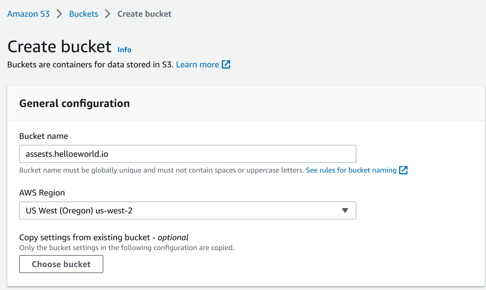

## Serving Avatars via CloudFront

###Setting up CloudFront

1) Goto AWS-->CloudFront-->Distributions 
2) Click on Create distribution
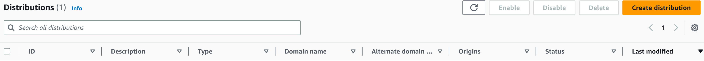
3) Under Origin domain, select the assests bucket you create
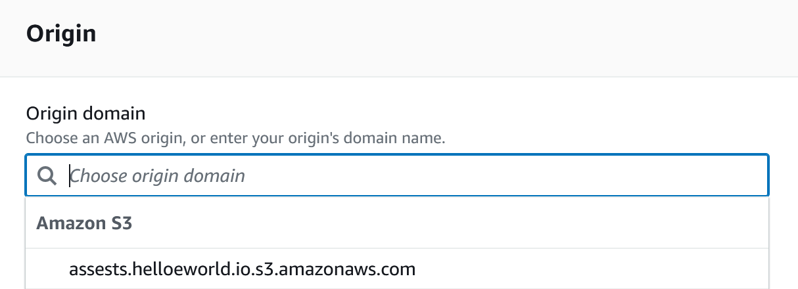
4) Under Origin access, select Origin access control settings (recommended)
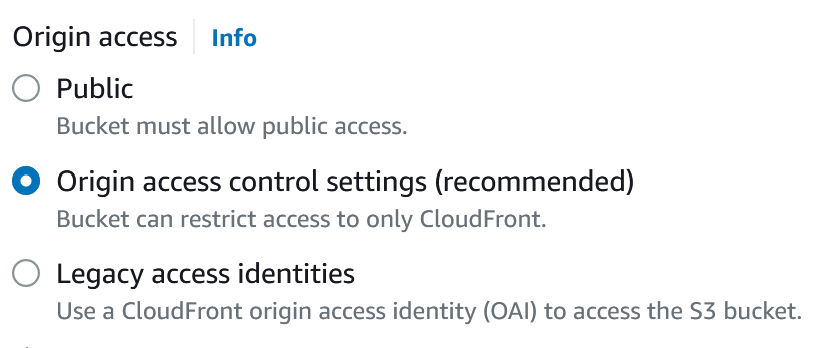
5) lick on Create Control setting
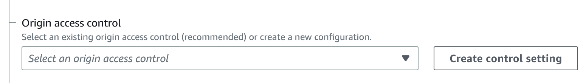
6) ccept the defaults and click on create
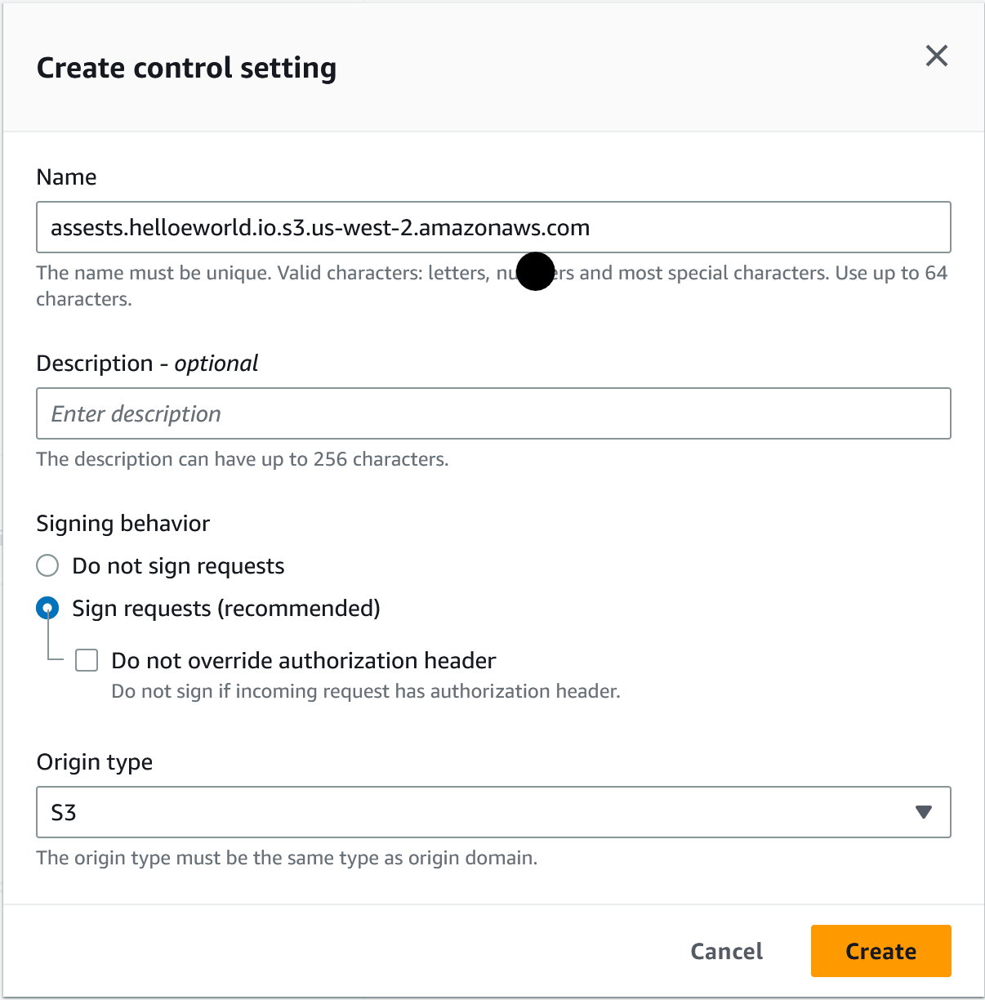
7) Under Viewer section, select Redirect HTTP to HTTPS 

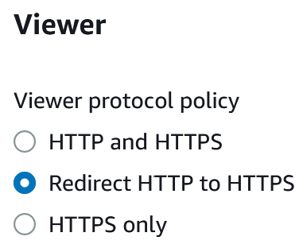

8) Under Cache key and origin requests, make sure cache policy is selected
9) Under Cache policy section, select Caching Optimized
10) Under Origin request policy - ptional, select CORS-CustomOrigin
11) Under Response Headers Policy, select SimpleCORS
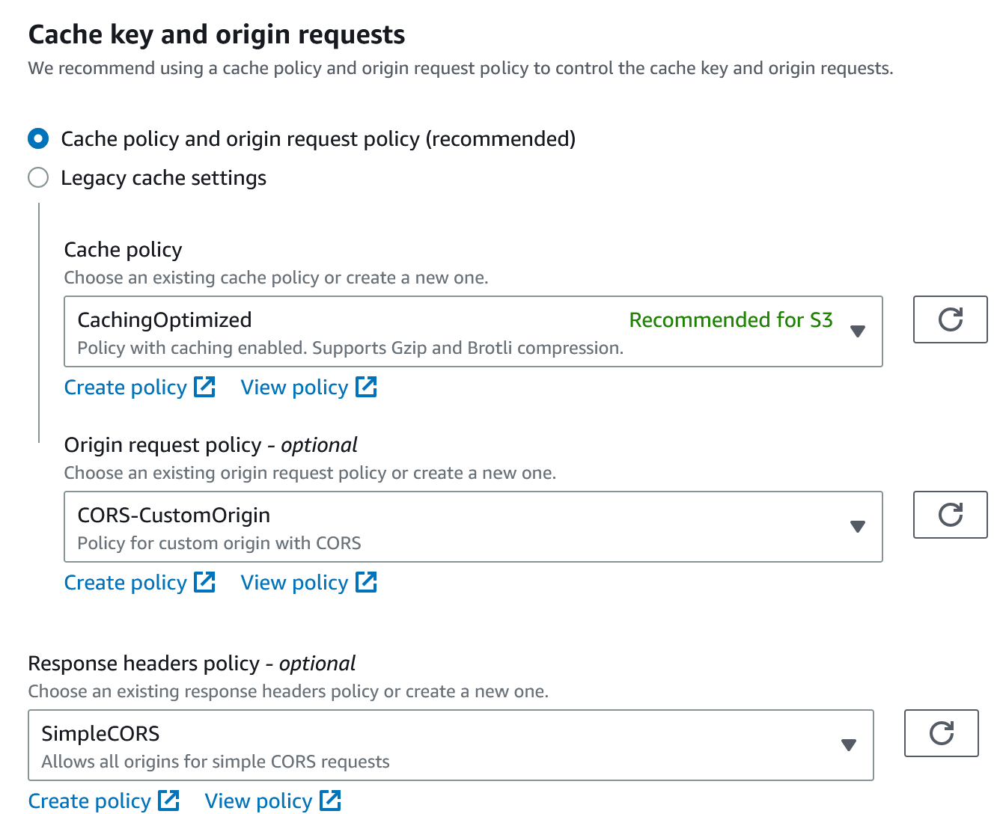
12)Under Alternate domain name(CNAME), enter "assests.yourdomainname"
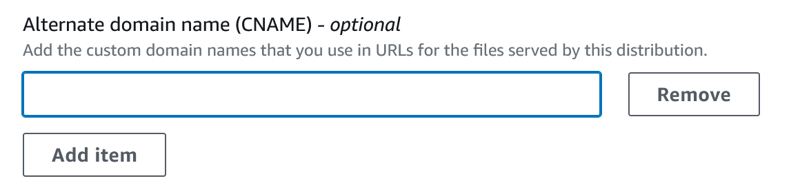
13)Under Custom SSL certificate, select the SSL certificate.(NOTE: You may need to create a certificate in us-east-1 if you have not done so already)

12) Click on Create distribution

###Configuring Route53 to point to Cloudfront distrubtion
1) Goto AWS-->Route53-->Hosted Zones
2) Seect your Hosted zone name

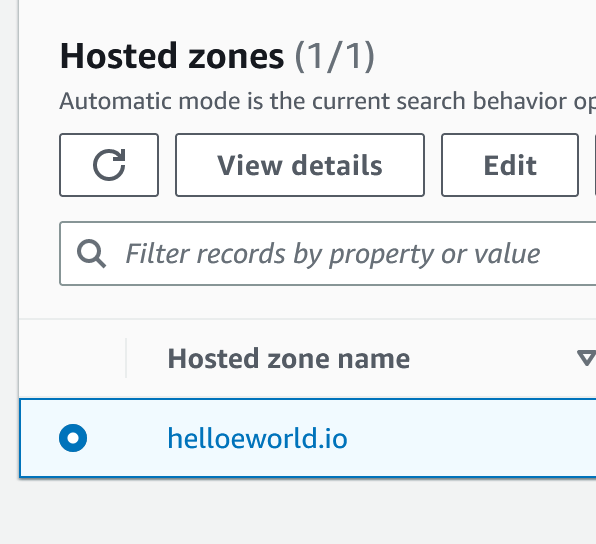

3) Click on Create Record
4) Under Record Name, enter assests
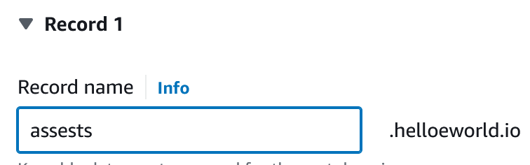
5) Enable Alias (Note: Enabling Alias will allow you to redirect traffic to an AWS resource
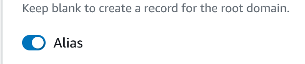
6) Under Route traffic to, select Alias to CloudFront distrbution
7) Select your cloudfront distrubtion you created earlier
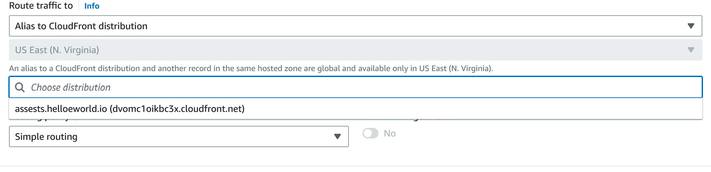
8) Click on Create Records
 
###Configure Bucket Policy to be used with CloudFront
1) Goto AWS-->CloudFront-->Distributions 
2) Select the CloudFront Distribution, you create earlier
 
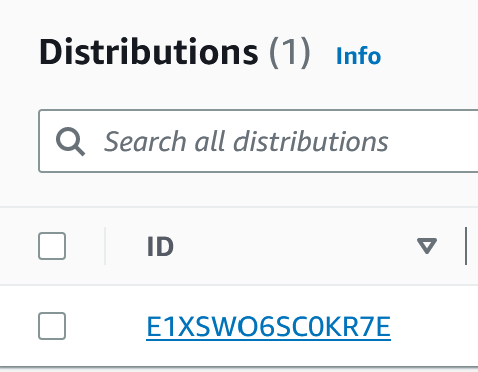

3) Under the Origins tab, select your Cloudfront Distribution, you crete earlier
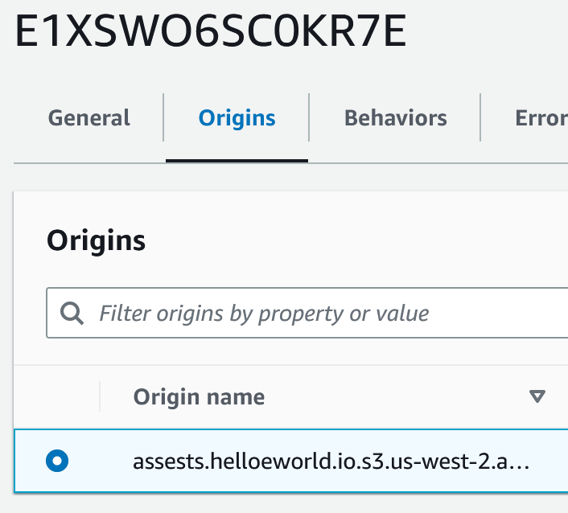
4) Click Edit button
5) Under Access click on Copy Policy
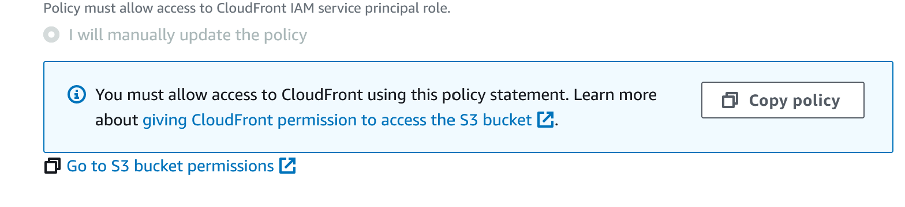
6) Click on the Go to S3 bucket permissions link
7) Under Bucket Policy, click on Edit
8) Paste in the bucket policy generated by the CloudFront Distribution
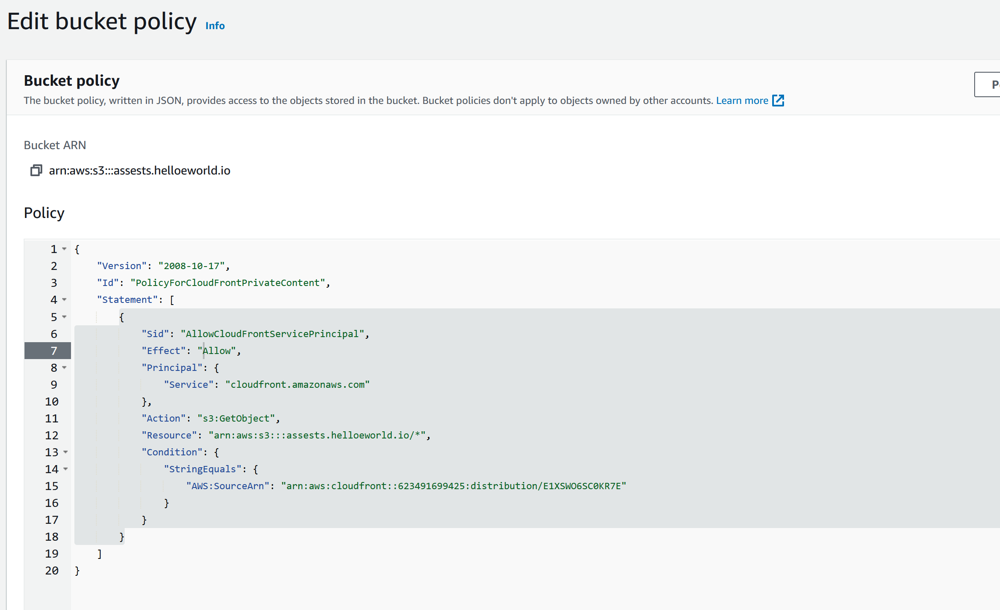
9) Click on Save Changes

## Implementing Users Profile Page

### Create a `bootstrap` file under `/bin` 
This file creates frontend.env and backend.env files.  This also logs into AWS ECR.

```shell
#! /usr/bin/bash
set -e # stop if it fails at any point

CYAN='\033[1;36m'
NO_COLOR='\033[0m'
LABEL="bootstrap"
printf "${CYAN}====== ${LABEL}${NO_COLOR}\n"

ABS_PATH=$(readlink -f "$0")
BIN_DIR=$(dirname $ABS_PATH)

source "$BIN_DIR/ecr/login"
ruby "$BIN_DIR/backend/generate-env"
ruby "$BIN_DIR/frontend/generate-env"
```

### Create a file called `show.sql` under `backend-flask\db\sql\users`
This file will show the latest cruds by the user.
```sql
SELECT
  (SELECT COALESCE(row_to_json(object_row),'{}'::json) FROM (
    SELECT
      users.uuid,
      users.cognito_user_id as cognito_user_uuid,
      users.handle,
      users.display_name,
      users.bio,
      (
        SELECT 
        count(true) 
       FROM public.activities
       WHERE
        activities.user_uuid = users.uuid
       ) as cruds_count
  ) object_row) as profile,
  (SELECT COALESCE(array_to_json(array_agg(row_to_json(array_row))),'[]'::json) FROM (
    SELECT
      activities.uuid,
      users.display_name,
      users.handle,
      activities.message,
      activities.created_at,
      activities.expires_at
    FROM public.activities
    WHERE
      activities.user_uuid = users.uuid
    ORDER BY activities.created_at DESC 
    LIMIT 40
  ) array_row) as activities
FROM public.users
WHERE
  users.handle = %(handle)s
```

### Modify `user_activities.py` under `backend-flask\services\`
Replace the hardcoded user value with the following code to show user activities outside of the hard coded user.

```py
from lib.db import db

if user_handle == None or len(user_handle) < 1:
      model['errors'] = ['blank_user_handle']
    else:
      sql = db.template('users','show')
      results = db.query_object_json(sql,{'handle': user_handle})
      model['data'] = results
```

### Modify `userfeedpage.js` under `\frontend-react-js\src\pages`

```js
import './UserFeedPage.css';
import React from "react";
import { useParams } from 'react-router-dom';

import DesktopNavigation  from '../components/DesktopNavigation';
import DesktopSidebar     from '../components/DesktopSidebar';
import ActivityFeed from '../components/ActivityFeed';
import ActivityForm from '../components/ActivityForm';
import ProfileHeading from '../components/ProfileHeading';
import ProfileForm from '../components/ProfileForm';

import {checkAuth,getAccessToken} from '../lib/CheckAuth';

export default function UserFeedPage() {
  const [activities, setActivities] = React.useState([]);
  const [profile, setProfile] = React.useState([]);
  const [popped, setPopped] = React.useState([]);
  const [poppedProfile, setPoppedProfile] = React.useState([]);
  const [user, setUser] = React.useState(null);
  const dataFetchedRef = React.useRef(false);

  const params = useParams();

  const loadData = async () => {
    try {
      const backend_url = `${process.env.REACT_APP_BACKEND_URL}/api/activities/@${params.handle}`
      await getAccessToken()
      const access_token = localStorage.getItem("access_token")
      const res = await fetch(backend_url, {
        headers: {
          Authorization: `Bearer ${access_token}`
        },
        method: "GET"
      });
      let resJson = await res.json();
      if (res.status === 200) {
        setProfile(resJson.profile)
        setActivities(resJson.activities)
      } else {
        console.log(res)
      }
    } catch (err) {
      console.log(err);
    }
  };

  React.useEffect(()=>{
    //prevents double call
    if (dataFetchedRef.current) return;
    dataFetchedRef.current = true;

    loadData();
    checkAuth(setUser);
  }, [])

  return (
    <article>
      <DesktopNavigation user={user} active={'profile'} setPopped={setPopped} />
      <div className='content'>
        <ActivityForm popped={popped} setActivities={setActivities} />
        <ProfileForm 
          profile={profile}
          popped={poppedProfile} 
          setPopped={setPoppedProfile} 
        />        
        <div className='activity_feed'>
          <ProfileHeading setPopped={setPoppedProfile} profile={profile} />
          <ActivityFeed activities={activities} />
        </div>
      </div>
      <DesktopSidebar user={user} />
    </article>
  );
}
```

### Add Edit Profile button

####Create a file called `EditProfileButton.js` under `frontend-react-js\src\componenets`

```js
import './EditProfileButton.css';

export default function EditProfileButton(props) {
  const pop_profile_form = (event) => {
    event.preventDefault();
    props.setPopped(true);
    return false;
  }

  return (
    <button onClick={pop_profile_form} className='profile-edit-button' href="#">Edit Profile</button>
  );
}
```

####Create a file called  `EditProfileButton.css` under ``frontend-react-js\src\componenets`

```css
.profile-edit-button {
    border: solid 1px rgba(255,255,255,0.5);
    padding: 12px 20px;
    font-size: 18px;
    background: none;
    border-radius: 999px;
    color: rgba(255,255,255,0.8);
    cursor: pointer;
  }
  
  .profile-edit-button:hover {
    background: rgba(255,255,255,0.3)
  }
```
### Refactor `ActivityFeed.js` under `frontend-react-js\src\components`

```js
import './ActivityFeed.css';
import ActivityItem from './ActivityItem';

export default function ActivityFeed(props) {
  return (
    <div className='activity_feed_collection'>
      {props.activities.map(activity => {
      return  <ActivityItem setReplyActivity={props.setReplyActivity} setPopped={props.setPopped} key={activity.uuid} activity={activity} />
      })}
    </div>
  );
}
```

### Refactor Activity Feed Section in `HomeFeedPage.js` under `frontend-react-js\src\pages` to include modfications done to the `UserFeedPage.js`

```js
        <div className='activity_feed'>
          <div className='activity_feed_heading'>
            <div className='title'>Home</div>
          </div>
          <ActivityFeed 
            setReplyActivity={setReplyActivity} 
            setPopped={setPoppedReply} 
            activities={activities} 
          />
        </div>
```
### Refactor Activity Feed Section in `NotificationFeedPage.js` under `frontend-react-js\src\pages` to include modfications done to the `UserFeedPage.js`

```js
        <div className='activity_feed'>
          <div className='activity_feed_heading'>
            <div className='title'>Notifications</div>
          </div>
          <ActivityFeed 
            setReplyActivity={setReplyActivity} 
            setPopped={setPoppedReply} 
            activities={activities} 
          />
        </div>
```

### Create `ProfileHeading.js` under `frontend-react-js/src/components`
```js
import './ProfileHeading.css';
import EditProfileButton from '../components/EditProfileButton';

export default function ProfileHeading(props) {
  const backgroundImage = 'url("https://assests.helloeworld.io/banners/banner.jpg")';
  const styles = {
    backgroundImage: backgroundImage,
    backgroundSize: 'cover',
    backgroundPosition: 'center',
  };
  return (
  <div className='activity_feed_heading profile_heading'>
    <div className='title'>{props.profile.display_name}</div>
    <div className="cruds_count">{props.profile.cruds_count} Cruds</div>
    <div className="banner" style={styles} >
      <div className="avatar">
        </img>
      </div>
    </div>
    <div className="info">
      <div className='id'>
        <div className="display_name">{props.profile.display_name}</div>
        <div className="handle">@{props.profile.handle}</div>
      </div>
      <EditProfileButton setPopped={props.setPopped} />
    </div>
    <div className="bio" >{props.profile.bio}</div>

  </div>
  );
}
```

### Create `ProfileHeading.css` under `frontend-react-js/src/components`
```css
.profile_heading {
    padding-bottom: 0px;
  }
  .profile_heading .avatar {
    position: absolute;
    bottom:-74px;
    left: 16px;
  }
  .profile_heading .avatar img {
    width: 148px;
    height: 148px;
    border-radius: 999px;
    border: solid 8px var(--fg);
  }
  
  .profile_heading .banner {
    position: relative;
    height: 200px;
  }
  
  .profile_heading .info {
    display: flex;
    flex-direction: row;
    align-items: start;
    padding: 16px;
  }
  
  .profile_heading .info .id {
    padding-top: 70px;
    flex-grow: 1;
  }
  
  .profile_heading .info .id .display_name {
    font-size: 24px;
    font-weight: bold;
    color: rgb(255,255,255);
  }
  .profile_heading .info .id .handle {
    font-size: 16px;
    color: rgba(255,255,255,0.7);
  }
```
  
## Implementing MIgrations Backend Endpoint and Profile Form

### Create a `prepare` file under `/bin` 
This file will prepare the database after launching the application thru docker.
```shell
#! /usr/bin/bash
set -e # stop if it fails at any point

CYAN='\033[1;36m'
NO_COLOR='\033[0m'
LABEL="bootstrap"
printf "${CYAN}====== ${LABEL}${NO_COLOR}\n"

ABS_PATH=$(readlink -f "$0")
BIN_PATH=$(dirname $ABS_PATH)
DB_PATH="$BIN_PATH/db"
DDB_PATH="$BIN_PATH/ddb"
echo "====$"
echo $DB_PATH
echo "====$"

source "$DB_PATH/db-create"
source "$DB_PATH/db-schema-load"
source "$DB_PATH/db-seed"
python "$DB_PATH/db-update_cognito_user_ids"
python "$DDB_PATH/schema-load"
python "$DDB_PATH/seed"
```

### Create a file called `jsconfig.json` at `frontend-react-js`

This file will set the explicit includes so that anything in the source directory will be allow to reference it at the root level.
```json
{
  "compilerOptions": {
    "baseUrl": "src"
  },
  "include": ["src"]
}
```

### Import the Edit Profile Button code into `UserFeedPage.js`

```js

import ProfileHeading from '../components/ProfileHeading';
import ProfileForm from '../components/ProfileForm';

  <div className='content'>
        <ActivityForm popped={popped} setActivities={setActivities} />
        <ProfileForm 
          profile={profile}
          popped={poppedProfile} 
          setPopped={setPoppedProfile} 
        />
```

### Create a file called `ProfileForm.js` under `frontend-react-js/src/components/`

```js
import './ProfileForm.css';
import React from "react";
import process from 'process';
import {getAccessToken} from 'lib/CheckAuth';


export default function ProfileForm(props) {
  const [bio, setBio] = React.useState('');
  const [displayName, setDisplayName] = React.useState('');

  React.useEffect(()=>{
    setBio(props.profile.bio || '');
    setDisplayName(props.profile.display_name);
  }, [props.profile])

  const s3uploadkey = async (extension)=> {
    console.log('ext',extension)
    try {
      const gateway_url = `${process.env.REACT_APP_API_GATEWAY_ENDPOINT_URL}/avatars/key_upload`
      await getAccessToken()
      const access_token = localStorage.getItem("access_token")
      const json = {
        extension: extension
      }
      const res = await fetch(gateway_url, {
        method: "POST",
        body: JSON.stringify(json),
        headers: {
          'Origin': process.env.REACT_APP_FRONTEND_URL,
          'Authorization': `Bearer ${access_token}`,
          'Accept': 'application/json',
          'Content-Type': 'application/json'
        }
      })
      let data = await res.json();
      if (res.status === 200) {
        return data.url
      } else {
        console.log(res)
      }
    } catch (err) {
      console.log(err);
    }
  }
  const s3upload = async (event)=> {
    console.log('event',event)
    const file = event.target.files[0]
    const filename = file.name
    const size = file.size
    const type = file.type
    const preview_image_url = URL.createObjectURL(file)
    console.log(filename,size,type)
    const fileparts = filename.split('.')
    const extension = fileparts[fileparts.length-1]
    const presignedurl = await s3uploadkey(extension)
    try {
      console.log('s3upload')
      const res = await fetch(presignedurl, {
        method: "PUT",
        body: file,
        headers: {
          'Content-Type': type
      }})
      if (res.status === 200) {
        
      } else {
        console.log(res)
      }
    } catch (err) {
      console.log(err);
    }
  }
  const onsubmit = async (event) => {
    event.preventDefault();
    try {
      const backend_url = `${process.env.REACT_APP_BACKEND_URL}/api/profile/update`
      await getAccessToken()
      const access_token = localStorage.getItem("access_token")
      const res = await fetch(backend_url, {
        method: "POST",
        headers: {
          'Authorization': `Bearer ${access_token}`,
          'Accept': 'application/json',
          'Content-Type': 'application/json'
        },
        body: JSON.stringify({
          bio: bio,
          display_name: displayName
        }),
      });
      let data = await res.json();
      if (res.status === 200) {
        setBio(null)
        setDisplayName(null)
        props.setPopped(false)
      } else {
        console.log(res)
      }
    } catch (err) {
      console.log(err);
    }
  }

  const bio_onchange = (event) => {
    setBio(event.target.value);
  }

  const display_name_onchange = (event) => {
    setDisplayName(event.target.value);
  }

  const close = (event)=> {
    if (event.target.classList.contains("profile_popup")) {
      props.setPopped(false)
    }
  }

  if (props.popped === true) {
    return (
      <div className="popup_form_wrap profile_popup" onClick={close}>
        <form 
          className='profile_form popup_form'
          onSubmit={onsubmit}
        >
          <div className="popup_heading">
            <div className="popup_title">Edit Profile</div>
            <div className='submit'>
              <button type='submit'>Save</button>
            </div>
          </div>
          <div className="popup_content">
            
          <input type="file" name="avatarupload" onChange={s3upload} />
           
            <div className="field display_name">
              <label>Display Name</label>
              <input
                type="text"
                placeholder="Display Name"
                value={displayName}
                onChange={display_name_onchange} 
              />
            </div>
            <div className="field bio">
              <label>Bio</label>
              <textarea
                placeholder="Bio"
                value={bio}
                onChange={bio_onchange} 
              />
            </div>
          </div>
        </form>
      </div>
    );
  }
}
```

### Create a file called `ProfileForm.css` under `frontend-react-js/src/components/`

```css
.profile_popup .upload {
  color: white;
  background: green;
}

form.profile_form input[type='text'],
form.profile_form textarea {
  font-family: Arial, Helvetica, sans-serif;
  font-size: 16px;
  border-radius: 4px;
  border: none;
  outline: none;
  display: block;
  outline: none;
  resize: none;
  width: 100%;
  padding: 16px;
  border: solid 1px var(--field-border);
  background: var(--field-bg);
  color: #fff;
}

.profile_popup .popup_content {
  padding: 16px;
}

form.profile_form .field.display_name {
  margin-bottom: 24px;
}

form.profile_form label {
  color: rgba(255,255,255,0.8);
  padding-bottom: 4px;
  display: block;
}

form.profile_form textarea {
  height: 140px;
}

form.profile_form input[type='text']:hover,
form.profile_form textarea:focus {
  border: solid 1px var(--field-border-focus)
}

.profile_popup button[type='submit'] {
  font-weight: 800;
  outline: none;
  border: none;
  border-radius: 4px;
  padding: 10px 20px;
  font-size: 16px;
  background: rgba(149,0,255,1);
  color: #fff;
}
```

### Create a file called `Popup.css` under `frontend-react-js/src/components/`
```
.popup_form_wrap {
    z-index: 100;
    position: fixed;
    height: 100%;
    width: 100%;
    top: 0;
    left: 0;
    display: flex;
    flex-direction: column;
    justify-content: flex-start;
    align-items: center;
    padding-top: 48px;
    background: rgba(255,255,255,0.1)
  }
  
  .popup_form {
    background: #000;
    box-shadow: 0px 0px 6px rgba(190, 9, 190, 0.6);
    border-radius: 16px;
    width: 600px;
  }
  
  .popup_form .popup_heading {
    display: flex;
    flex-direction: row;
    border-bottom: solid 1px rgba(255,255,255,0.4);
    padding: 16px;
  }
  
  .popup_form .popup_heading .popup_title{
    flex-grow: 1;
    color: rgb(255,255,255);
    font-size: 18px;
  
  }
```

### Import the `Popup.css` component into `frontend-react-js/src/App.js`

```
import './components/Popup.css';
```

### Refactor `Reployform.css` under `front-end-react-js\src\components`

```css
form.replies_form {
  padding: 16px;
  display: flex;
  flex-direction: column;
}

.activity_wrap {
  padding: 16px;
}

form.replies_form textarea {
  font-family: Arial, Helvetica, sans-serif;
  font-size: 16px;
  border-radius: 4px;
  border: none;
  outline: none;
  display: block;
  outline: none;
  resize: none;
  width: 100%;
  height: 140px;
  padding: 16px;
  border: solid 1px rgba(149,0,255,0.1);
  background: rgba(149,0,255,0.1);
  color: #fff;
}

form.replies_form textarea:focus {
  border: solid 1px rgb(149,0,255,1);
}

form.replies_form .submit {
  display: flex;
  flex-direction: row;
  justify-content: flex-end;
  align-items: center;
  margin-top: 12px;
  font-weight: 600;
}

form.replies_form button[type='submit'] {
  font-weight: 800;
  outline: none;
  border: none;
  border-radius: 4px;
  border-top-right-radius: 0;
  border-bottom-right-radius: 0;
  height: 38px;
  padding: 10px 20px;
  font-size: 16px;
  margin-left: 12px;
  background: rgba(149,0,255,1);
  color: #fff;
}

form.replies_form .count {
  color: rgba(255,255,255,0.3)
}

form.replies_form .count.err {
  color: rgb(255, 0, 0)
}

form.replies_form .expires_at_field {
  display: flex;
  gap: 12px;
  position: relative;
  border-left: solid 1px rgba(149,0,255,0.7);
}

form.replies_form .expires_at_field .icon {
  position: absolute;
  top: 12px;
  left: 8px;
  fill: #fff;
  width: 14px;
  height: 14px;
  z-index: 2;
}
```

### Implement Update Profile Endpoint in `\backend-flask\app.py`

```py

from services.update_profile import *

@app.route("/api/profile/update", methods=['POST','OPTIONS'])
@cross_origin()
def data_update_profile():
  bio          = request.json.get('bio',None)
  display_name = request.json.get('display_name',None)
  access_token = extract_access_token(request.headers)
  try:
    claims = cognito_jwt_token.verify(access_token)
    cognito_user_id = claims['sub']
    UpdateProfile.run(
      cognito_user_id=cognito_user_id,
      bio=bio,
      display_name=display_name
    )
    if model['errors'] is not None:
      return model['errors'], 422
    else:
      return model['data'], 200
  except TokenVerifyError as e:
    # unauthenicatied request
    app.logger.debug(e)
    return {}, 401
```

### Create new `update_profile.py` service under `backend-flask\services`
```py
from lib.db import db

class UpdateProfile:
  def run(cognito_user_id,bio,display_name):
    model = {
      'errors': None,
      'data': None
    }

    if display_name == None or len(display_name) < 1:
      model['errors'] = ['display_name_blank']

    if model['errors']:
      model['data'] = {
        'bio': bio,
        'display_name': display_name
      }
    else:
      handle = UpdateProfile.update_profile(bio,display_name,cognito_user_id)
      data = UpdateProfile.query_users_short(handle)
      model['data'] = data
    return model
  
  def update_profile(bio,display_name,cognito_user_id):
    if bio == None:    
      bio = ''

    sql = db.template('users','update')
    handle = db.query_commit(sql,{
      'cognito_user_id': cognito_user_id,
      'bio': bio,
      'display_name': display_name
    })
  def query_users_short(handle):
    sql = db.template('users','short')
    data = db.query_select_object(sql,{
      'handle': handle
    })
    return data
```

### Create a `update.sql` under `backend-flask\db\sql\users`
This query will update the users profile data

```sql
UPDATE public.users 
SET 
  bio = %(bio)s,
  display_name= %(display_name)s
WHERE 
  users.cognito_user_id = %(cognito_user_id)s
RETURNING handle;
```

### Create a new file called `migration` under `backend-flask/bin/generate/`
```py
#!/usr/bin/env python3
import time
import os
import sys

if len(sys.argv) == 2:
  name = sys.argv[1]
else:
  print("pass a filename: eg. ./bin/generate/migration hello")
  exit(0)

timestamp = str(time.time()).replace(".","")

filename = f"{timestamp}_{name}.py"

klass = name.replace('_', ' ').title().replace(' ','')

file_content = f"""
class {klass}Migration(Migration):
  def migrate_sql():
    data = \"\"\"
    \"\"\"
    return data
  def rollback_sql():
    data = \"\"\"
    \"\"\"
    return data
  def migrate():
    this.query_commit(this.migrate_sql(),{{
    }})
  def rollback():
    this.query_commit(this.rollback_sql(),{{
    }})
"""
file_content = file_content.lstrip('\n').rstrip('\n')

current_path = os.path.dirname(os.path.abspath(__file__))
file_path = os.path.abspath(os.path.join(current_path, '..', '..','backend-flask','db','migrations',filename))
print(file_path)

with open(file_path, 'w') as f:
  f.write(file_content)
```

### Create a file called `migrate` under `bin\db\`

```shell
#!/usr/bin/env python3

import os
import sys
import glob
import re
import time
import importlib

current_path = os.path.dirname(os.path.abspath(__file__))
parent_path = os.path.abspath(os.path.join(current_path, '..', '..','backend-flask'))
sys.path.append(parent_path)
from lib.db import db

def get_last_successful_run():
  sql = """
    SELECT last_successful_run
    FROM public.schema_information
    LIMIT 1
  """
  return int(db.query_value(sql,{},verbose=False))

def set_last_successful_run(value):
  sql = """
  UPDATE schema_information
  SET last_successful_run = %(last_successful_run)s
  """
  db.query_commit(sql,{'last_successful_run': value},verbose=False)
  return value

last_successful_run = get_last_successful_run()

migrations_path = os.path.abspath(os.path.join(current_path, '..', '..','backend-flask','db','migrations'))
sys.path.append(migrations_path)
migration_files = glob.glob(f"{migrations_path}/*")


for migration_file in migration_files:
  filename = os.path.basename(migration_file)
  module_name = os.path.splitext(filename)[0]
  match = re.match(r'^\d+', filename)
  if match:
    file_time = int(match.group())
    if last_successful_run <= file_time:
      mod = importlib.import_module(module_name)
      print('=== running migration: ',module_name)
      mod.migration.migrate()
      timestamp = str(time.time()).replace(".","")
      last_successful_run = set_last_successful_run(timestamp)
```

### Create a file called `rollback` under `bin\db\`
```
#!/usr/bin/env python3

import os
import sys
import glob
import re
import time
import importlib

current_path = os.path.dirname(os.path.abspath(__file__))
parent_path = os.path.abspath(os.path.join(current_path, '..', '..','backend-flask'))
sys.path.append(parent_path)
from lib.db import db

def get_last_successful_run():
  sql = """
    SELECT last_successful_run
    FROM public.schema_information
    LIMIT 1
  """
  return int(db.query_value(sql,{},verbose=False))

def set_last_successful_run(value):
  sql = """
  UPDATE schema_information
  SET last_successful_run = %(last_successful_run)s
  WHERE id =1
  """
  db.query_commit(sql,{'last_successful_run': value})
  return value

last_successful_run = get_last_successful_run()

migrations_path = os.path.abspath(os.path.join(current_path, '..', '..','backend-flask','db','migrations'))
sys.path.append(migrations_path)
migration_files = glob.glob(f"{migrations_path}/*")


last_migration_file = None
for migration_file in migration_files:
  if last_migration_file == None:
    filename = os.path.basename(migration_file)
    module_name = os.path.splitext(filename)[0]
    match = re.match(r'^\d+', filename)
    if match:
      file_time = int(match.group())
      if last_successful_run > file_time:
        last_migration_file = module_name
        mod = importlib.import_module(module_name)
        print('=== rolling back migration: ',module_name)
        mod.migration.rollback()
        set_last_successful_run(file_time)
```

### Modifying `16822751419807823_add_bio_column.pyadd_bio_column.py` under `backend-flask\db\migrations`

Make use the `bin/generate/migration` is executable and run the following script `./bin/generate/migaration add_bio_column`
The command will geneate a file called `16822751419807823_add_bio_column.pyadd_bio_column.py` under `backend-flask\db\migrations`

Modify the `16822751419807823_add_bio_column.pyadd_bio_column.py` file with the following code:

```py
from lib.db import db

class AddBioColumnMigration:
  def migrate_sql():
    data = """
    ALTER TABLE public.users ADD COLUMN bio text;
    """
    return data
  def rollback_sql():
    data = """
    ALTER TABLE public.users DROP COLUMN bio;
    """
    return data

  def migrate():
    db.query_commit(AddBioColumnMigration.migrate_sql(),{
    })
  def rollback():
    db.query_commit(AddBioColumnMigration.rollback_sql(),{
    })
    
migration = AddBioColumnMigration
```

### Create a new table to add to the users profile.

Under `backend-flask\db`, add the following code to the `schema.sql` query
```sql
CREATE TABLE IF NOT EXISTS public.schema_information (
  id integer UNIQUE,
  last_successful_run text
);
INSERT INTO public.schema_information(id,last_successful_run)
VALUES (1, '0')
ON CONFLICT (id) DO NOTHING;
```

### Modify the `db.py` under `backend-flask/lib`
Locate the following section of the code:
```py
  def query_commit (self,sql,params={}):
    self.print_sql('commit with returning',sql,params)
```
Replace with:
```py
  def query_commit (self,sql,params={},verbose=True):
    if verbose:
      self.print_sql('commit with returning',sql,params)
```

Locate the following section of the code:
```py
  def query_value(self,sql,params={}):
    self.print_sql('value',sql,params)
```
Replace with:
```py
  def query_value(self,sql,params={},verbose=True):
    if verbose:
      self.print_sql('value',sql,params)
```

Locate the following section of the code:
```py
  def query_array_json(self,sql,params={}):
    self.print_sql('array',sql,params)
```
Replace with:
```py
  def query_array_json(self,sql,params={},verbose=True):
    if verbose:
      self.print_sql('array',sql,params)
```
Locate the following section of the code:
```py
  def query_object_json(self,sql,params={}):
```
Replace with:
```py  
  def query_object_json(self,sql,params={},verbose=True):
    if verbose:
      self.print_sql('json',sql,params)
      self.print_params(params)
```

Remove the following lines of code from  `app.py`

```py
   self.print_sql('json',sql,params)
   self.print_params(params)
```
### Add the bio information to users profile

Modify the `profileheading.js` located in  `frontend-react-js/src/components`

```js
    <div class="bio" >{props.profile.bio}</div>
```

Modify the `profileheading.css` located in  `frontend-react-js/src/components`
```css
  .profile_heading .cruds_count {
    color: rgba(255,255,255,0.7);
  }

  .profile_heading .bio {
    padding: 16px;
    color: rgb(255,255,255,0.7);
```
## Implement Uploading Avatars Images

### Modify the `ProfileForm.js` under `frontend-react-js\src\components`

Locate the following section of the code:
```js
  const [bio, setBio] = React.useState(0);
  const [displayName, setDisplayName] = React.useState(0);
```
Replace with:
```js
  const [bio, setBio] = React.useState('');
  const [displayName, setDisplayName] = React.useState('');
```

Locate the following section of the code:
```js
    console.log('useEffects',props)
    setBio(props.profile.bio);
```
Replace with:
```js
    setBio(props.profile.bio || '');
```

Locate the following section of the code:
```js
          <div class="popup_heading">
            <div class="popup_title">Edit Profile</div>
```
Replace with:
```js
          <div className="popup_heading">
            <div className="popup_title">Edit Profile</div>
```
### Add code to upload data to S3. 
In `ProfileForm.js` under `frontend-react-js\src\components`

```js
  const s3uploadkey = async (extension)=> {
    console.log('ext',extension)
    try {
      const gateway_url = `${process.env.REACT_APP_API_GATEWAY_ENDPOINT_URL}/avatars/key_upload`
      await getAccessToken()
      const access_token = localStorage.getItem("access_token")
      const json = {
        extension: extension
      }
      const res = await fetch(gateway_url, {
        method: "POST",
        body: JSON.stringify(json),
        headers: {
          'Origin': process.env.REACT_APP_FRONTEND_URL,
          'Authorization': `Bearer ${access_token}`,
          'Accept': 'application/json',
          'Content-Type': 'application/json'
        }
      })
      let data = await res.json();
      if (res.status === 200) {
        return data.url
      } else {
        console.log(res)
      }
    } catch (err) {
      console.log(err);
    }
  }
  const s3upload = async (event)=> {
    console.log('event',event)
    const file = event.target.files[0]
    const filename = file.name
    const size = file.size
    const type = file.type
    const preview_image_url = URL.createObjectURL(file)
    console.log(filename,size,type)
    const fileparts = filename.split('.')
    const extension = fileparts[fileparts.length-1]
    const presignedurl = await s3uploadkey(extension)
    try {
      console.log('s3upload')
      const res = await fetch(presignedurl, {
        method: "PUT",
        body: file,
        headers: {
          'Content-Type': type
      }})
      if (res.status === 200) {
        
      } else {
        console.log(res)
      }
    } catch (err) {
      console.log(err);
    }
  }
```

```js
          <div className="popup_content">       
          <input type="file" name="avatarupload" onChange={s3upload} />
            <div className="field display_name">
```

### Create Lambda Function that creates a presigned URL to upload avatar images

#### Generate a gemfile with libraries

1) Goto `aws/lambdas/cruddur-upload-avatar`
2) Run the following command: `bundle init`
3) Add the following libraries to the gem filte
```ruby
gem "aws-sdk-s3"
gem "ox"
gem "jwt"
```

#### Under `aws/lambdas/cruddur-upload-avatar`, create a file called `function.rb`

```ruby
require 'aws-sdk-s3'
require 'json'
require 'jwt'

def handler(event:, context:)
  puts event
  # return cors headers for preflight check
  if event['routeKey'] == "OPTIONS /{proxy+}"
    puts({step: 'preflight', message: 'preflight CORS check'}.to_json)
    { 
      headers: {
        "Access-Control-Allow-Headers": "*, Authorization",
        "Access-Control-Allow-Origin": "https://*.gitpod.io",
        "Access-Control-Allow-Methods": "OPTIONS,GET,POST"
      },
      statusCode: 200
    }
  else
    token = event['headers']['authorization'].split(' ')[1]
    puts({step: 'presignedurl', access_token: token}.to_json)

    body_hash = JSON.parse(event["body"])
    extension = body_hash["extension"]

    decoded_token = JWT.decode token, nil, false
    cognito_user_uuid = decoded_token[0]['sub']

    s3 = Aws::S3::Resource.new
    bucket_name = ENV["UPLOADS_BUCKET_NAME"]
    object_key = "#{cognito_user_uuid}.#{extension}"

    puts({object_key: object_key}.to_json)

    obj = s3.bucket(bucket_name).object(object_key)
    url = obj.presigned_url(:put, expires_in: 60 * 5)
    url # this is the data that will be returned
    body = {url: url}.to_json
    { 
      headers: {
        "Access-Control-Allow-Headers": "*, Authorization",
        "Access-Control-Allow-Origin": "*.gitpod.io",
        "Access-Control-Allow-Methods": "OPTIONS,GET,POST"
      },
      statusCode: 200, 
      body: body 
    }
  
  end # if 
end # def handler
```

#### Under `aws/policies/`, create a file called `s3-upload-avatar-presigned-url-policy.json`
```json
{
    "Version": "2012-10-17",
    "Statement": [
        {
            "Sid": "VisualEditor0",
            "Effect": "Allow",
            "Action": "s3:PutObject",
            "Resource": "arn:aws:s3:::<cruddur uploaded avatars bucket name>/*"
        }
    ]
}
```
#### Create AvatarUpload Function

1) Goto AWS-->Lambda, click on the Create Function button
2) Click on Create distribution
3) Fill out the Create Function with the following information:
    a) Function name: CruddurAvatarUploads
    b) Runtime: Ruby 2.7
    c) Architecture: x86_64
    d) Execution Role: Crate a new role with basic Lambda Permissions
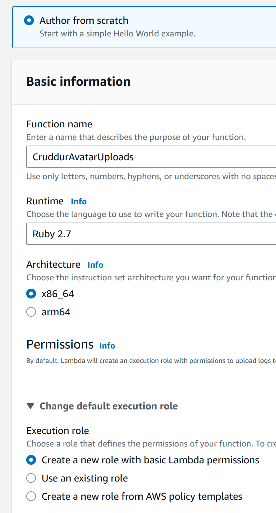
4) Rename the function from lambda_functions.rb ro function.rb
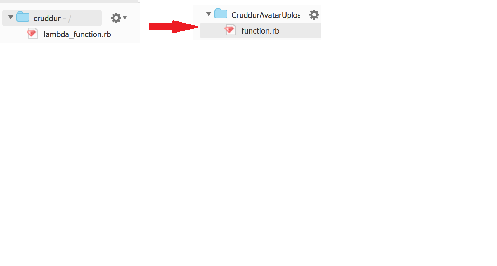
5) Copy and paste the code from the `aws/lambdas/cruddur-upload-avatar/function.rb` from your GitHub Repo.
6) Goto Configuration-->Permissions, and click on the Role name
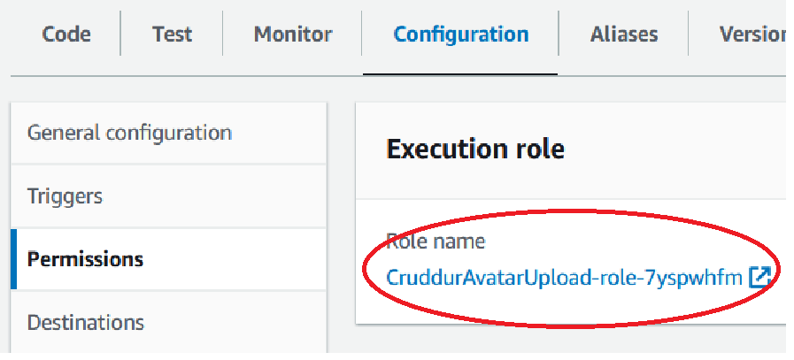
7) Click on Add Permisions, and select Create inline policy
 
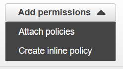

8) Copy and paste the code from the `aws/policies/s3-upload-avatar-presigned-url-policy.json` from your GitHub Repo.
9) Click on Review Policy
10) In the name field, enter **PresignedUrlAvatarPolicy**

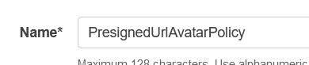

11) Click on Create Policy
12) Goto AWS-->Lambda
13) Goto Configuration-->Environment Variables
14) Click on Edit
15) Fill out the Environment variables with the following information:
     a) Key: UPLOADS_BUCKET_NAME
     b) Value:<cruddur uploaded avatars bucket name>
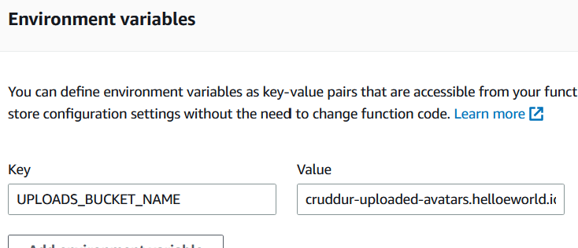

