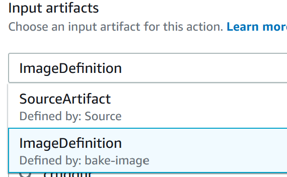

# Week 9 — CI/CD with CodePipeline, CodeBuild and CodeDeploy

## Create a file called `buildspec.yml` under `backend-flask` folder

```yaml
# Buildspec runs in the build stage of your pipeline.
version: 0.2
phases:
  install:
    runtime-versions:
      docker: 20
    commands:
      - echo "cd into $CODEBUILD_SRC_DIR/backend-flask"
      - cd $CODEBUILD_SRC_DIR/backend-flask
      - aws ecr get-login-password --region $AWS_DEFAULT_REGION | docker login --username AWS --password-stdin $IMAGE_URL
  build:
    commands:
      - echo Build started on `date`
      - echo Building the Docker image...          
      - docker build -t backend-flask .
      - "docker tag $REPO_NAME $IMAGE_URL/$REPO_NAME"
  post_build:
    commands:
      - echo Build completed on `date`
      - echo Pushing the Docker image..
      - docker push $IMAGE_URL/$REPO_NAME
      - cd $CODEBUILD_SRC_DIR
      - echo "imagedefinitions.json > [{\"name\":\"$CONTAINER_NAME\",\"imageUri\":\"$IMAGE_URL/$REPO_NAME\"}]" > imagedefinitions.json
      - printf "[{\"name\":\"$CONTAINER_NAME\",\"imageUri\":\"$IMAGE_URL/$REPO_NAME\"}]" > imagedefinitions.json
env:
  variables:
    AWS_ACCOUNT_ID: <your own AWS account id>
    AWS_DEFAULT_REGION: us-west-2
    CONTAINER_NAME: backend-flask
    IMAGE_URL: <your own AWS account id>.dkr.ecr.<region>.amazonaws.com
    REPO_NAME: backend-flask:latest
artifacts:
  files:
    - imagedefinitions.json
    
```

## Create a Build Project using CodeBuild

1) Goto CodeBuild
2) Click on Create Build Project
3) Enter the following information:
    a) Project Name: **cruddur-backend-flask-bake-image**
    
    b) Build-Badge: Make sure Enable build badge is selected
    
     
    
4) Under Source, use the following information

    a) Source Provider: **Github**
    
    b) Repository: **Repository in my GitHub Account**
    
    c) Github Repository: **aws-bootcamp-cruddur-2023.bit**
    
    d) Source Version: **prod**
    
     
    
5) Under Primary source webhook events, use the following information

    a) Webhook: Enable  **Rebuild every time a code change is pushed to this repository**
    
    b) Build Type: **Single Build**
    
    c) Event Type: **Pull_Request_Merged**
    
     
    
6) Under Environment, use the following information

    a) Environment Image: **Managed Image**
    
    b) Operating System: **Amazon Linux 2**
    
    c) Runtime: **Standard**
    
    d) Image: **standard:4.0** or **latest image**
    
    e) Image version: **Always use the latest image for this runtime version**
    
    f) Environment type: **Linux**
    
    g) Privileged: Make sure the box is checked
    
    h) Service Role: **New Service Role**
    
    i) Role Name: **codebuild-cruddur-servuce-riole**
    
     
    
7)  Under Additional Configuration, use the following information:

    a) Timeout: 15 minutes
    
    b) Queued Timeount : 8 hours
    
    c) Certificate: **Do not install any Certificate**
    
    d) Compute: Select 3 GB Memroy, and 2 vCPUs
    
8) Under Buildspec section, use the following information

    a) Build Specifications: **Use a buildspec file**
    b) Buildspec name: **backend-flask/buildspec.yml**

 

9) Click on Create build project button
10) Goto IAM-->Roles
11) Search for **codebuild-cruddur-backend-flask-service-role**

 

12) Add the **AmazonEC2ContainerRegistryFullAccess** Policy to the role

 


## Setting up CodePipeline

1) Goto CodePipeline
2) Click on Create Pipeline
3) Under Pipeline name, enter **cruddur-backend-fargate**

 

4) Click Next
5) Under Sources Provider, select **GitHub (Version 2)**

 

6) Click on Connect to Github
7) A new window will popup, in the connection name field enter **cruddur**

 

8) You will be prompted for your GitHub credentials.  Enter your Github credentials

 

9) Under GitHub Apps, select your account

 

10) Click Connect
11) Under Repository Name, select your project **aws-bootcamp-cruddur-2023** 

 

12) Under Branch name select **prod**

 

13) Click Next
14) Click on Skip Build Stage
16) Under Add Deploy Stage, use the following information

      a) Deploy Provider: **Aamazon ECS**
      
      b) Region: Select the Region
      
      c) Cluster name: (Select the name of ECS Cluster) **Cruddur**
      
      d) Service name: (Select the name of the service) **backend-flask**
      
       
      
17) Click on Create Pipeline
18) Under source, Click on Add Stage 

 

20) In the Stage Name, enter bake-image

 

22) Under Edit:bake-image, click on the Add Action Group button

 

23) Enter the following information for the Action Group

    a) Action Name: **bake-image**
    
    b) Action Provider: **AWS Codebuild**
    
    c) Region: (Select the region you are using)
    
    d) Input Artifacts: **Source Artifact**
    
    e) Project naem: **cruddur-backend-bake-image**
    

 
24) Goto Edit:Deplo
25) Click on Edit stage
26) In the Deploy Amazon ECS Click on the Notepad/Pencil icon


27) Under Input artifacts, select **ImageDefiniton**



## Modify Health Check in `app.py`

Locate the following section of the code:
```py
 return {'success': True}, 200
```
Replace with:
```py
  return {'success': True, 'ver': 1}, 200
```


